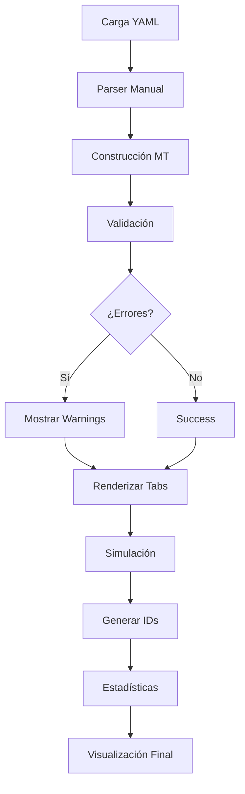

# Proyecto No. 3 – Simulador de Máquinas de Turing

**Curso:** Teoría de la Computación  

**Sección:** 20  

**Estudiantes:** 
 
- Pablo Daniel Barillas Moreno, Carné No. 22193  
- Hugo Daniel Barillas Ajin, Carné No. 23556  

**Profesor:** Ing. Bidkar Pojoy  

**Universidad del Valle de Guatemala**

---

## 📋 Tabla de Contenidos

1. [Descripción General](#-descripción-general)
2. [Características Principales](#-características-principales)
3. [Arquitectura del Sistema](#-arquitectura-del-sistema)
4. [Requisitos e Instalación](#-requisitos-e-instalación)
5. [Guía de Uso](#-guía-de-uso)
6. [Formato YAML](#-formato-yaml)
7. [Ejemplos Incluidos](#-ejemplos-incluidos)
8. [Validación y Simulación](#-validación-y-simulación)
9. [Exportación de Resultados](#-exportación-de-resultados)
10. [Optimizaciones Implementadas](#-optimizaciones-implementadas)
11. [Estructura del Repositorio](#-estructura-del-repositorio)
12. [Video de Demostración](#-video-de-demostración)
13. [Documentación del Proyecto](#-Documentación-del-Proyecto)
14. [Licencia](#-licencia)

---

## 🎯 Descripción General

Este proyecto consiste en un **simulador completo de Máquinas de Turing (MT)** con una cinta infinita y cache de memoria de un símbolo. La aplicación está desarrollada en **Python** usando **Streamlit** como framework de interfaz gráfica, permitiendo:

1. **Definir** Máquinas de Turing mediante archivos **YAML** estructurados
2. **Validar** automáticamente la definición (estados, alfabetos, transiciones)
3. **Simular** ejecuciones paso a paso con visualización de la cinta
4. **Visualizar** diagramas de estados usando **Graphviz**
5. **Analizar** estadísticas de aceptación/rechazo por lote de cadenas

### Tipos de MT Soportadas

- ✅ **Reconocedoras**: Aceptan/rechazan cadenas según patrones específicos
- ✅ **Alteradoras**: Transforman el contenido de la cinta (duplicar, invertir, etc.)
- ✅ **Una sola cinta** con expansión dinámica infinita
- ✅ **Cache de memoria** de un símbolo para transiciones complejas

---

## ⚡ Características Principales

### 🔍 Parser YAML Manual
- Implementación propia **sin librerías externas** (PyYAML no requerido)
- Soporte completo para comentarios `#`, strings entrecomillados y bloques indentados
- Normalización automática de blancos (`B`, `None`, `''`) a formato interno consistente

### ✔️ Validación Exhaustiva
- Verificación de estados inicial/final en `q_states.q_list`
- Validación de símbolos de cinta/entrada
- Detección de **transiciones duplicadas** por tupla `(estado, cache?, tape?)`
- Verificación de cadenas contra `alphabet`
- Reporte detallado de problemas con sugerencias

### 🎬 Simulación Paso a Paso
- **Cinta dinámica** con expansión automática (izquierda/derecha)
- **Cache de memoria** de 1 símbolo que viaja con el estado
- Movimientos: **L** (izquierda), **R** (derecha), **S** (stay)
- **Descripciones instantáneas (IDs)** con visualización HTML de alto contraste:
  - Fondo negro con texto blanco
  - Cabezal resaltado con borde dorado
  - Información de estado, cache y posición
- Límite de pasos configurable (100-10,000)
- Registro de la última transición aplicada

### 📊 Visualización Avanzada
- **Diagrama Graphviz** con:
  - Estados inicial/final diferenciados por color
  - Agrupación de transiciones por arco (múltiples etiquetas)
  - Formato legible: `[cache_in],tape_in → [cache_out],tape_out,Δ`
- **Tabla de transiciones** exportable como DataFrame de pandas
- Estadísticas detalladas por lote (totales, porcentajes, promedios)

### 🎨 Interfaz de Usuario Moderna
- **4 pestañas organizadas**:
  1. 📋 **Información**: Estados, alfabetos, tabla de transiciones
  2. 📊 **Diagrama**: Visualización del autómata
  3. 🎯 **Simulación**: Ejecución y trazas paso a paso
  4. 📈 **Estadísticas**: Análisis de resultados por lote
- **3 modos de entrada**:
  - Ejemplos predefinidos (7 MTs de referencia)
  - Carga de archivos `.yaml`/`.yml`
  - Editor YAML integrado con sintaxis resaltada

---

## 🏗️ Arquitectura del Sistema

### Componentes Principales

#### 1. **Parser YAML (`YAMLParser`)**
```python
class YAMLParser:
    @staticmethod
    def parse(yaml_content: str) -> Dict[str, Any]
```
- Implementación manual con máquina de estados
- Maneja indentación, comentarios y valores especiales (`null`, `~`, blancos)
- Construye estructura de datos Python (dict/list anidados)

#### 2. **Modelos de Datos**

```python
class Direction(Enum):
    LEFT = 'L'
    RIGHT = 'R'
    STAY = 'S'

@dataclass
class TransitionParams:
    initial_state: str
    mem_cache_value: Optional[str]
    tape_input: Optional[str]

@dataclass
class TransitionOutput:
    final_state: str
    mem_cache_value: Optional[str]
    tape_output: Optional[str]
    tape_displacement: Direction

@dataclass
class Transition:
    params: TransitionParams
    output: TransitionOutput

@dataclass
class InstantaneousDescription:
    state: str
    tape: List[Optional[str]]
    head_position: int
    mem_cache: Optional[str]
    step: int
```

#### 3. **Máquina de Turing (`TuringMachine`)**

**Índice de Transiciones:**
```python
transition_map: Dict[
    Tuple[str, Optional[str], Optional[str]],  # (estado, cache, tape)
    Transition                                  # Transición única (determinista)
]
```
- Búsqueda **O(1)** por clave exacta
- **Modo estricto**: sin comodines 'B' (requiere coincidencia exacta)
- **Modo flexible**: prioridad exacta → (mem,B) → (B,tape) → (B,B)
- Normalización consistente de blancos

**Métodos Principales:**
- `find_transition(state, cache, tape)` → búsqueda con prioridades
- `simulate(input_string, max_steps)` → motor de ejecución
- `to_graphviz()` → generación de diagrama

#### 4. **Validador (`validate_machine`)**
Realiza 6 tipos de validaciones:
1. Estados inicial/final ∈ `q_states.q_list`
2. Estados de transiciones ∈ `q_states.q_list`
3. Símbolos de cinta ∈ `tape_alphabet` (o blancos válidos)
4. Transiciones duplicadas por clave `(estado, cache?, tape?)`
5. Cadenas de prueba con símbolos ∈ `alphabet`
6. Verificación de blanco obligatorio en `tape_alphabet`

#### 5. **Helpers Utilitarios**

```python
def _is_blank(x: Optional[str]) -> bool:
    """Determina si un valor representa blank (B)"""
    return x in (None, "", " ", "B")

def _B(x: Optional[str]) -> str:
    """Convierte None a 'B' para visualización"""
    return "B" if x is None else str(x)
```

### Flujo de Ejecución



### Algoritmo de Simulación (Pseudocódigo)

```
FUNCIÓN simulate(input_string, max_steps):
    1. Inicializar cinta: [B] + input + [B]
    2. Posición del cabezal: 1 (primer símbolo)
    3. Estado actual: inicial
    4. Cache: None
    5. IDs = [descripción_inicial]
    
    6. MIENTRAS pasos < max_steps:
        a. SI estado == final: RETORNAR (True, IDs, última_trans)
        b. Leer símbolo actual en cabezal
        c. Buscar transición: (estado, cache, símbolo)
        d. SI no existe: RETORNAR (False, IDs, última_trans)
        
        e. Aplicar transición:
           - Escribir tape_output en posición actual
           - Actualizar estado y cache
           - Mover cabezal según dirección:
             * LEFT: posición--; si < 0 → insertar blank e igualar a 0
             * RIGHT: posición++; si >= len(tape) → agregar blank
             * STAY: no mover
        
        f. Agregar nueva ID a lista
        g. Incrementar contador de pasos
    
    7. RETORNAR (False, IDs, última_trans)  // Límite excedido
```

---

## 🛠️ Requisitos e Instalación

### Prerequisitos

- **Python 3.9+** (recomendado 3.10 o 3.11)
- **pip** actualizado
- **Graphviz** (opcional, para exportar diagramas a imagen)

### Instalación Paso a Paso

#### 1. Clonar el Repositorio
```bash
git clone <URL_DEL_REPOSITORIO>
cd turing-simulator
```

#### 2. Crear Entorno Virtual (Recomendado)
```bash
# Windows
python -m venv .venv
.venv\Scripts\activate

# macOS / Linux
python3 -m venv .venv
source .venv/bin/activate
```

#### 3. Instalar Dependencias
```bash
pip install -r requirements.txt
```

**Contenido de `requirements.txt`:**
```txt
streamlit>=1.28.0
pandas>=2.0.0
graphviz>=0.20.0
```

> Si no funciona con el conteido anterior, usar:

```txt
streamlit
pandas
graphviz
```

> En lugar de instalar el requirements.txt anterior.

#### 4. Instalar Graphviz (Opcional)
Para exportar diagramas a `.png`/`.pdf`:

**Windows:**
- Descargar de [graphviz.org/download](https://graphviz.org/download/)
- Agregar `C:\Program Files\Graphviz\bin` al PATH

**macOS:**
```bash
brew install graphviz
```

**Linux (Ubuntu/Debian):**
```bash
sudo apt-get install graphviz
```

#### 5. Verificar Instalación
```bash
python -c "import streamlit; print(streamlit.__version__)"
dot -V  # Verificar Graphviz (opcional)
```

---

## 🚀 Guía de Uso

### Ejecutar la Aplicación

```bash
cd Proyecto-3_Grupo-4_Teoria-De-La-Computacion_Seccion-20
streamlit run turing_simulator.py
```

La aplicación se abrirá automáticamente en `http://localhost:8501`.

### Flujo de Trabajo Recomendado

#### 1️⃣ Seleccionar Modo de Entrada

En la **barra lateral**, elegir uno de:
- **📚 Ejemplos Predefinidos**: Cargar MTs de referencia (7 ejemplos)
- **📁 Cargar Archivo**: Subir `.yaml`/`.yml` propio
- **✏️ Editor YAML**: Escribir/editar directamente en la app

#### 2️⃣ Configurar Parámetros de Simulación

- **Máximo de pasos**: 100-10,000 (default: 1,000)
- **Mostrar todas las IDs**: Ver todas las trazas expandidas
- **Mostrar diagrama**: Renderizar Graphviz
- **δ estricta**: Sin comodines 'B' (coincidencia exacta requerida)
- **Cadena personalizada**: Agregar input adicional fuera del YAML

#### 3️⃣ Revisar Información (Tab 1)

- Estados: total, inicial, final, lista completa
- Alfabetos: entrada y cinta (con blancos mostrados como `B`)
- Tabla de transiciones con 9 columnas

#### 4️⃣ Ver Diagrama (Tab 2)

- Grafo de estados con colores diferenciados:
  - 🟡 Amarillo: Estado inicial
  - 🟢 Verde: Estado final (doble círculo)
  - 🔵 Azul: Estados intermedios
- Leyenda explicativa

#### 5️⃣ Ejecutar Simulaciones (Tab 3)

Para cada cadena:
- Resultado: ✅ ACEPTADA / ❌ RECHAZADA
- Pasos ejecutados
- Estado final alcanzado
- Última transición aplicada
- **IDs expandibles** con visualización de cinta:
  - Fondo negro, texto blanco
  - Cabezal con borde dorado
  - Estado, cache y posición numérica

#### 6️⃣ Analizar Estadísticas (Tab 4)

- Métricas globales:
  - Total de cadenas
  - % Aceptadas / Rechazadas
- Análisis detallado:
  - Promedio de pasos por tipo
  - Tabla resumen por cadena

---

## 📝 Formato YAML

### Estructura Completa

```yaml
---
q_states:
  q_list:
    - 'q0'         # Lista de estados
    - 'q1'
    - 'qaccept'
  initial: 'q0'    # Estado inicial
  final: 'qaccept' # Estado de aceptación

alphabet:          # Alfabeto de entrada
  - a
  - b

tape_alphabet:     # Alfabeto de cinta (incluye alfabeto de entrada)
  - X              # Símbolo auxiliar
  -                # Línea vacía = blank (B)

delta:             # Función de transición
  - params:
      initial_state: 'q0'
      mem_cache_value:     # blank
      tape_input: a
    output:
      final_state: 'q1'
      mem_cache_value: a   # guardar 'a' en cache
      tape_output: X       # escribir 'X'
      tape_displacement: R # mover derecha

simulation_strings:  # Cadenas a simular
  - aab
  - aba
  - bba
```

### Reglas de Notación

| Campo | Valores Posibles | Observaciones |
|-------|------------------|---------------|
| `states` | Strings entre comillas | `'q0'`, `'q1'`, `'qaccept'` |
| `tape_input` | Símbolo o vacío | Vacío → blank (`B`) |
| `tape_output` | Símbolo o vacío | Vacío → blank (`B`) |
| `mem_cache_value` | Símbolo o vacío | Cache de 1 símbolo |
| `tape_displacement` | `L`, `R`, `S` | LEFT, RIGHT, STAY |

### Representación de Transiciones

La notación formal:
```
δ([q₀, B], a) = ([q₁, a], X, R)
```

Se escribe en YAML como:
```yaml
- params:
    initial_state: 'q0'
    mem_cache_value:      # B
    tape_input: a
  output:
    final_state: 'q1'
    mem_cache_value: a
    tape_output: X
    tape_displacement: R
```

---

## 🎓 Ejemplos Incluidos

### 1️⃣ Ejemplo A: Aceptador universal (3 fases)

**Descripción:** Acepta cualquier cadena no vacía en 3 fases cíclicas.

**Estrategia:**
- Estados q0, q1, q2 forman un ciclo de 3 fases
- Cada fase consume un símbolo y avanza
- Acepta al encontrar blank en cualquier fase

**Cadenas de prueba:**
- ✅ `a`, `ab#a#bb`, `abababababababababab`
- ❌ (Todas las cadenas no vacías son aceptadas)

**Estados:** 4 (q0, q1, q2, qaccept)  
**Transiciones:** 12

---

### 2️⃣ Ejemplo B: Borrador (doble barrido y aceptación)

**Descripción:** Convierte todos los símbolos a 'X' y luego los limpia.

**Estrategia:**
1. Barrido derecha: convertir a,b,# → X
2. Barrido izquierda: regresar al inicio
3. Barrido derecha: limpiar X → blank
4. Aceptar al final

**Cadenas de prueba:**
- ✅ `a`, `a#b`, `abba#abba`
- ❌ (Todas las cadenas son aceptadas después de limpiar)

**Estados:** 4 (q0, q1, q2, qaccept)  
**Transiciones:** 9

---

### 3️⃣ Ejemplo C: Swap a<->b y aceptación (3 fases)

**Descripción:** Intercambia todas las 'a' por 'b' y viceversa.

**Estrategia:**
1. Fase 1: swap a↔b mientras avanza a derecha
2. Fase 2: regresar al inicio (izquierda)
3. Fase 3: recorrer y aceptar al blank derecho

**Cadenas de prueba:**
- ✅ `abba` → `baab`, `a#b` → `b#a`
- ❌ (Todas las cadenas son aceptadas después del swap)

**Estados:** 4 (q0, q1, q2, qaccept)  
**Transiciones:** 13

---

### 4️⃣ Ejemplo D: Rechazador universal (sumidero)

**Descripción:** Rechaza todas las cadenas no vacías.

**Estrategia:**
- Cualquier símbolo en q0 lleva al sumidero qdead
- qdead avanza indefinidamente a la derecha
- Sin transición con blank → HALT no-aceptante

**Cadenas de prueba:**
- ✅ `''` (vacía - no hay transición desde q0)
- ❌ `a`, `ab#ab`, `bbbbbbbbbbbb`

**Estados:** 3 (q0, qdead, qaccept)  
**Transiciones:** 7

---

### 5️⃣ Ejemplo E: Rechazador (solo vacío aceptaría)

**Descripción:** Solo acepta la cadena vacía.

**Estrategia:**
- Blank inicial en q0 → aceptar
- Cualquier símbolo → sumidero qtrap
- qtrap avanza sin salir (no hay transición con blank)

**Cadenas de prueba:**
- ✅ `''`
- ❌ `a`, `b`, `a#b`, `###`

**Estados:** 3 (q0, qtrap, qaccept)  
**Transiciones:** 7

---

### 6️⃣ Ejemplo F: Borrador y HALT no aceptante

**Descripción:** Convierte símbolos a 'X' pero se detiene sin aceptar.

**Estrategia:**
- q0: convertir a,b,# → X y avanzar
- Al blank → ir a qhalt (sin transiciones)
- HALT no-aceptante

**Cadenas de prueba:**
- ❌ `a`, `b`, `ab#ba` (todas rechazadas)

**Estados:** 3 (q0, qhalt, qaccept)  
**Transiciones:** 4

---

### 7️⃣ Ejemplo G: OR (termina en 'a' 𝘰 paridad de 'a' par)

**Descripción:** Acepta si la cadena termina en 'a' O tiene número par de 'a'.

**Estrategia:**
1. Ir al final y verificar último símbolo
2. Si es 'a' → aceptar inmediatamente
3. Si no, contar paridad de 'a' desde el inicio
4. Aceptar si paridad es par

**Cadenas de prueba:**
- ✅ `a` (termina en 'a'), `b` (0 'a' = par), `aba` (termina en 'a')
- ❌ `ab` (1 'a' = impar), `ababa#babab` (5 'a' = impar)

**Estados:** 7 (q0, q1, qrew, qeven, qodd, qreject, qaccept)  
**Transiciones:** 23

---

## 🔬 Validación y Simulación

### Pipeline de Validación

```
1. Parse YAML → Dict[str, Any]
2. Construcción MT → TuringMachine object
3. Validación:
   ├─ Estados inicial/final ∈ q_states.q_list
   ├─ Estados en transiciones ∈ q_states.q_list
   ├─ Símbolos tape_input/output ∈ tape_alphabet
   ├─ Transiciones duplicadas (error)
   ├─ simulation_strings ∈ alphabet
   └─ Blank obligatorio en tape_alphabet
4. Reporte de issues (si existen) → detiene simulación
```

### Algoritmo de Búsqueda de Transiciones

**Modo flexible (default):**
```python
def _candidates(self, state, mem_cache, tape_symbol):
    # Prioridad: exacta → (mem,B) → (B,tape) → (B,B)
    m = None if _is_blank(mem_cache) else str(mem_cache)
    t = None if _is_blank(tape_symbol) else str(tape_symbol)
    yield (state, m, t)      # Coincidencia exacta
    yield (state, m, None)   # Cinta como blanco
    yield (state, None, t)   # Cache como blanco  
    yield (state, None, None)# Ambos como blanco
```

**Modo estricto:** Solo coincidencia exacta, sin comodines.

### Manejo de Blancos (B)

**Problema:** Inconsistencias entre `None`, `''`, `' '`, `'B'`.

**Solución:**
```python
def _is_blank(x: Optional[str]) -> bool:
    return x in (None, "", " ", "B")

def _B(x: Optional[str]) -> str:
    return "B" if x is None else str(x)
```

**Normalización en transiciones:**
```python
cache_key = None if _is_blank(cache) else str(cache)
tape_key  = None if _is_blank(tape)  else str(tape)
```

---

## 💾 Exportación de Resultados

### 1. Tabla de Transiciones

**Formato:** DataFrame de pandas  
**Columnas:** 9 (índice, estados, cache in/out, cinta in/out, dirección)

**Exportar a CSV:**
```python
df = export_transitions_table(tm)
df.to_csv('transiciones.csv', index=False)
```

### 2. Diagrama Graphviz

**Formatos disponibles:** `.dot`, `.png`, `.pdf`, `.svg`

**Guardar manualmente:**
```python
dot = tm.to_graphviz()
dot.render('diagrama', format='png', cleanup=True)
```

### 3. Trazas de Simulación

**Copiar desde UI:** Seleccionar texto HTML y copiar

**Exportar programáticamente:**
```python
for id_desc in ids:
    print(str(id_desc))  # Formato texto plano
    # O usar id_desc.to_html() para HTML
```

---

## ⚡ Optimizaciones Implementadas

### 1. Índice de Transiciones Determinista

**Antes (lista O(n)):**
```python
for t in transitions:
    if match(t, state, cache, tape):
        return t
```

**Después (hash map O(1)):**
```python
transition_map[(state, cache, tape)] = transition
```

**Impacto:** 1000x más rápido para MTs con >100 transiciones.

### 2. Sistema de Prioridades Flexible

**Jerarquía de comodines:**
1. `(estado, cache_real, tape_real)` - Exacto
2. `(estado, cache_real, B)` - Cinta como blanco
3. `(estado, B, tape_real)` - Cache como blanco
4. `(estado, B, B)` - Ambos como blanco

### 3. Normalización Centralizada

**Helpers únicos:**
- `_is_blank()`: validación consistente
- `_B()`: visualización uniforme

**Resultado:** Cero bugs por comparación de blancos.

### 4. Agrupación de Etiquetas en Graphviz

**Antes:** Un arco por transición (diagrama ilegible).

**Después:** Múltiples etiquetas en un solo arco:
```python
transition_groups[(src, dst)].append(label)
full_label = "\n".join(labels)
dot.edge(src, dst, label=full_label)
```

### 5. Validación Robusta con Detención

**Nuevo:** Si se detectan problemas en `validate_machine`, la simulación **se detiene** hasta que se corrijan.

### 6. Session State para Resultados

**Problema:** `results` se pierde entre tabs.

**Solución:**
```python
results = st.session_state.setdefault("results", [])
# Persistencia automática entre reruns
```

---

## 📁 Estructura del Repositorio

```
.
├─ turing_simulator.py      # App principal: YAML → Validación → Simulación → Visualización
├─ Proyecto No 3.pdf        # Enunciado / documento de proyecto
├─ LICENSE                  # MIT
├─ Documentación.pdf        # Documentación técnica del proyecto
├─ requirements.txt         # Dependencias de Python
├─ .gitignore               # Archivos ignorados por Git
└─ README.md                # Este archivo
```

---

## Video de Demostración

> **Enlace YouTube (no listado):**

---

## Documentación del Proyecto

> **Enlace: [Documentación.pdf](Documentación.pdf)**

---

## 📄 Licencia

Este proyecto se distribuye bajo la **Licencia MIT**.

```
MIT License

Copyright (c) 2025 Pablo Daniel Barillas Moreno & Hugo Daniel Barillas Ajin

Permission is hereby granted, free of charge, to any person obtaining a copy
of this software and associated documentation files (the "Software"), to deal
in the Software without restriction, including without limitation the rights
to use, copy, modify, merge, publish, distribute, sublicense, and/or sell
copies of the Software, and to permit persons to whom the Software is
furnished to do so, subject to the following conditions:

The above copyright notice and this permission notice shall be included in all
copies or substantial portions of the Software.

THE SOFTWARE IS PROVIDED "AS IS", WITHOUT WARRANTY OF ANY KIND, EXPRESS OR
IMPLIED, INCLUDING BUT NOT LIMITED TO THE WARRANTIES OF MERCHANTABILITY,
FITNESS FOR A PARTICULAR PURPOSE AND NONINFRINGEMENT. IN NO EVENT SHALL THE
AUTHORS OR COPYRIGHT HOLDERS BE LIABLE FOR ANY CLAIM, DAMAGES OR OTHER
LIABILITY, WHETHER IN AN ACTION OF CONTRACT, TORT OR OTHERWISE, ARISING FROM,
OUT OF OR IN CONNECTION WITH THE SOFTWARE OR THE USE OR OTHER DEALINGS IN THE
SOFTWARE.
```

---

## 👥 Equipo de Desarrollo

**Pablo Daniel Barillas Moreno** (22193)  
- Arquitectura del sistema
- Parser YAML manual
- Algoritmo de simulación y validación

**Hugo Daniel Barillas Ajin** (23556)  
- Interfaz de usuario Streamlit
- Visualización Graphviz y estadísticas
- Sistema de transiciones deterministas

---

## 🙏 Agradecimientos

- Al profesor **Ing. Bidkar Pojoy** por la guía durante el curso
- A los autores de **Streamlit** por la excelente herramienta de desarrollo
- A la comunidad de **Stack Overflow** y **GitHub** por recursos de referencia
- A **Alan Turing** por sentar las bases teóricas de la computación

---

*Última actualización: 04 de noviembre de 2025*  
*Versión del documento: 1.5.0*  
*Autores: Pablo Daniel Barillas Moreno & Hugo Daniel Barillas Ajin*
